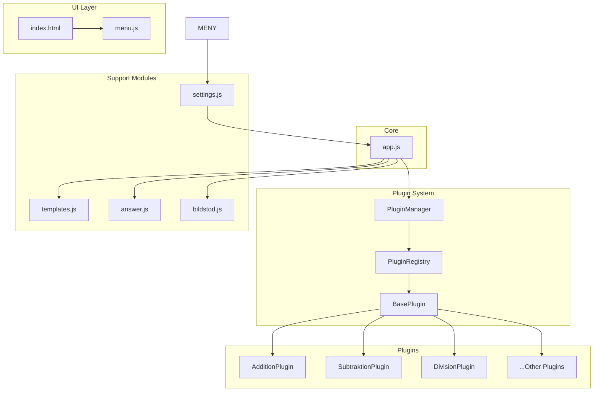

# Plan: Plugin-baserat matematiksystem för Klassrummatte

## Översikt

Denna plan beskriver hur vi konverterar det befintliga matematiksystemet till ett plugin-baserat arkitektur där varje matematiskt område är en egen klass som kan registreras, laddas och användas oberoende av andra komponenter.

## Mål

- Konvertera ALLA befintliga problemtyper till plugin-klasser
- Skapa ett centralt plugin-registersystem
- Möjliggöra enkelt tillägg av nya matematiska områden
- Behålla bakåtkompatibilitet med befintliga funktioner

---

## Steg 1: Skapa mappstruktur

Ny filstruktur:

```
js/
  plugins/
    PluginManager.js      # Central plugin-hanterare
    PluginRegistry.js     # Registrering av alla plugins
    BasePlugin.js         # Bas-klass för alla plugins
    plugins/              # Individuella plugin-filer
      AdditionPlugin.js
      SubtraktionPlugin.js
      MultiplikationPlugin.js
      DivisionPlugin.js
      PrioritetPlugin.js
      OppnaUtsagaPlugin.js
      BrakPlugin.js
      GeometriPlugin.js
      KlockaPlugin.js
      MattLangdPlugin.js
      MattVolymPlugin.js
```

---

## Steg 2: Definiera bas-klasser

### BasePlugin.js
Varje plugin ärver från `BasePlugin` som definierar det obligatoriska gränssnittet:

```javascript
class BasePlugin {
  constructor() {
    this.name = '';        // Visningsnamn
    this.type = '';        // Unikt ID (t.ex. 'addition')
  }

  // Generera ett problem-objekt
  generate(settings) { }

  // Rendera problem till DOM
  render(problem, container) { }

  // Visa svar
  showAnswer(problem, container) { }

  // Kontrollera om två problem är ekvivalenta (för upprepningsskydd)
  isSameProblem(a, b) { }

  // Kontrollera om bildstöd stöds
  hasBildstodSupport(problem, settings) { }

  // Bygg bildstöd-element
  buildBildstod(problem, settings) { }

  // Hämta checkbox-markup för meny
  getMenuCheckbox() { }
}
```

### PluginManager.js
Hantera registrering, uppladdning och åtkomst av plugins:

```javascript
class PluginManager {
  constructor() {
    this.plugins = new Map();
  }

  register(plugin) { }
  get(type) { }
  getAll() { }
  getTypes() { }
  generate(type, settings) { }
  render(type, problem, container) { }
}
```

### PluginRegistry.js
Central fil där alla plugins registreras manuellt:

```javascript
const PluginRegistry = [
  AdditionPlugin,
  SubtraktionPlugin,
  // ... alla plugins
];
```

---

## Steg 3: Konvertera befintliga problemtyper till plugins

Varje matematiskt område konverteras till en egen klass:

| Problemtyp | Plugin-klass | Fil |
|------------|--------------|-----|
| addition | AdditionPlugin | AdditionPlugin.js |
| subtraktion | SubtraktionPlugin.js |
| multiplikation | MultiplikationPlugin.js |
| division | DivisionPlugin.js |
| prioritet | PrioritetPlugin.js |
| oppna-utsagor | OppnaUtsagaPlugin.js |
| brak | BrakPlugin.js |
| geometri | GeometriPlugin.js |
| klocka | KlockaPlugin.js |
| matt-langd | MattLangdPlugin.js |
| matt-volym | MattVolymPlugin.js |

**Exempel: AdditionPlugin**

```javascript
class AdditionPlugin extends BasePlugin {
  constructor() {
    super();
    this.name = 'Addition';
    this.type = 'addition';
  }

  generate(settings) {
    // Flytta logik från problems.js genAddition()
    const c = cfg(settings.grade);
    const max = c.addMax;
    const a = randInt(1, Math.floor(max * 0.6));
    const b = randInt(1, max - a);
    return { type: this.type, a, b, operator: '+', answer: a + b };
  }

  render(problem, container) {
    // Flytta logik från render.js
  }

  // ... övriga metoder
}
```

---

## Steg 4: Uppdatera index.html

Ladda plugin-filerna i rätt ordning före app.js:

```html
<!-- Plugin-system -->
<script src="js/plugins/BasePlugin.js"></script>
<script src="js/plugins/plugins/AdditionPlugin.js"></script>
<!-- ... alla plugin-filer -->
<script src="js/plugins/PluginManager.js"></script>
<script src="js/plugins/PluginRegistry.js"></script>

<!-- Befintliga moduler (uppdaterade) -->
<script src="js/settings.js"></script>
<script src="js/templates.js"></script>
<!-- <-- problems.js TAS BORT, ersätts av plugins -->
<script src="js/render.js"></script>
<script src="js/bildstod.js"></script>
<script src="js/answer.js"></script>
<script src="js/menu.js"></script>
<script src="js/app.js"></script>
```

---

## Steg 5: Uppdatera befintliga moduler

### render.js
Ersätt switch-sats med anrop till PluginManager:

```javascript
function renderProblem(problem, container) {
  container.innerHTML = '';
  const plugin = PluginManager.get(problem.type);
  if (plugin) {
    plugin.render(problem, container);
  } else {
    // Fallback för bakåtkompatibilitet
    renderArithmetic(problem, container);
  }
}
```

### answer.js
Använd plugin för att visa svar:

```javascript
function showAnswer(problem, container) {
  const plugin = PluginManager.get(problem.type);
  if (plugin) {
    plugin.showAnswer(problem, container);
  }
  // ...
}
```

### bildstod.js
Använd plugin för bildstöd:

```javascript
function hasBildstodSupport(problem, settings) {
  const plugin = PluginManager.get(problem.type);
  if (plugin) {
    return plugin.hasBildstodSupport(problem, settings);
  }
  // ...
}
```

### app.js
Använd PluginManager för problemgenerering:

```javascript
function generateProblem() {
  const area = pickRandom(Settings.get('areas'));
  const plugin = PluginManager.get(area);
  if (plugin) {
    const problem = plugin.generate(Settings.getAll());
    // ...
  }
}
```

---

## Steg 6: Lägga till en ny plugin

Processen för att lägga till ett nytt matematiskt område:

1. **Skapa fil**: `js/plugins/plugins/NyttOmradePlugin.js`
2. **Implementera klass**: Ärv från `BasePlugin`, implementera alla metoder
3. **Registrera**: Lägg till i `PluginRegistry.js`
4. **Lägg till i meny**: Uppdatera `index.html` med checkbox

Inga ändringar behövs i render.js, answer.js, bildstod.js eller app.js!

---

## Arkitektur-diagram



---

## Risker och lösningar

| Risk | Lösning |
|------|---------|
| Större kodbas initialt | Plugin-systemet är mer organiserat på lång sikt |
| Backwards compatibility | Spara gamla funktioner som fallback |
| Testning | Testa varje plugin individuellt |
| Prestanda | PluginManager använder Map för snabb lookup |

---

## Implementeringsordning

1. Skapa mappstruktur (`js/plugins/`)
2. Skapa `BasePlugin.js`
3. Skapa `PluginManager.js`
4. Skapa `PluginRegistry.js`
5. Konvertera en enkel plugin (t.ex. Addition) som test
6. Uppdatera `index.html`
7. Uppdatera `render.js`, `answer.js`, `bildstod.js`
8. Uppdatera `app.js`
9. Konvertera alla återstående plugins
10. Testa hela systemet
